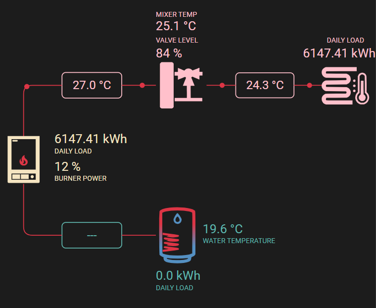

# Home Assistant Lovelace Card for the "heat flow" service

Here's what it looks like:



## Installation

* Copy the file dist/heat-flow-card to config/www/heat-flow-card/
* Go to Settings->Dashboards->Resources and add "/local/heat-flow-card/heat-flow-card.js" with type "JavaScript Module"
* Go back to a dashboard and add the "Custom: HeatFlow Card" card

Default configuration:

This card uses entities provided by EMS-ESP https://emsesp.org/

GIT https://github.com/emsesp
```yaml
type: 'custom:heat-flow-card'
heatingActive: binary_sensor.boiler_heating_active
waterHeatingActive: binary_sensor.boiler_dhw_3_way_valve_active
mixerPumpActive: switch.mixer_hc1_pump_status_pc1
burnerCurrentPower: sensor.boiler_burner_current_power
gasHeaterTemp: sensor.boiler_current_flow_temperature
boilerTankTemp: sensor.boiler_dhw_storage_extern_temperature
mixerFlowTemp: sensor.boiler_mixing_switch_temperature
floorSupplyTemp: sensor.mixer_hc1_flow_temperature_tc1
heatingFloorDailyLoad: sensor.boiler_energy_heating
boilerDailyLoad: sensor.boiler_dhw_energy
gasHeaterDailyLoad: sensor.boiler_total_energy
mixerValveLvl: sensor.mixer_hc1_mixing_valve_actuator_vc1

```

For Devs:
install yarn, then run yarn install to install dependencies and yarn build to regenerate the JS file in the dist directory.